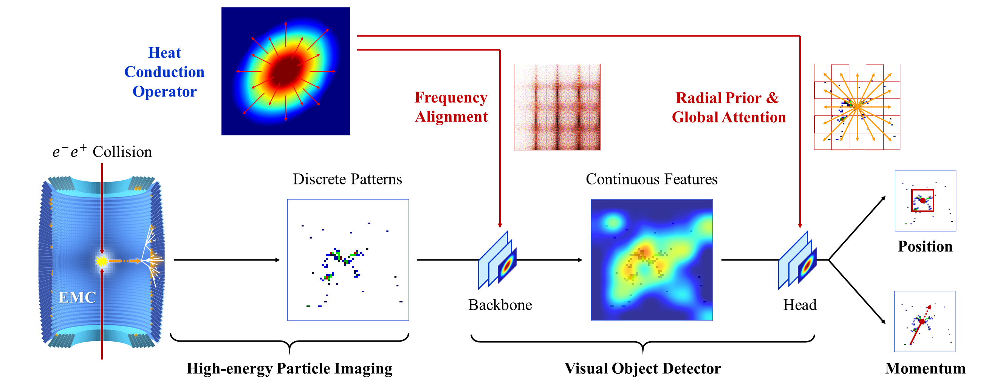
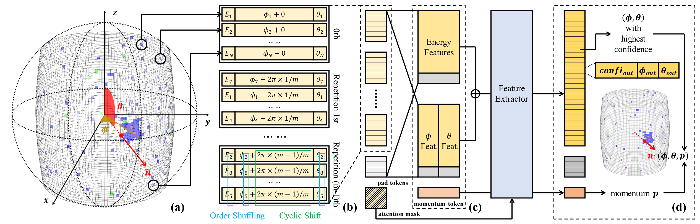
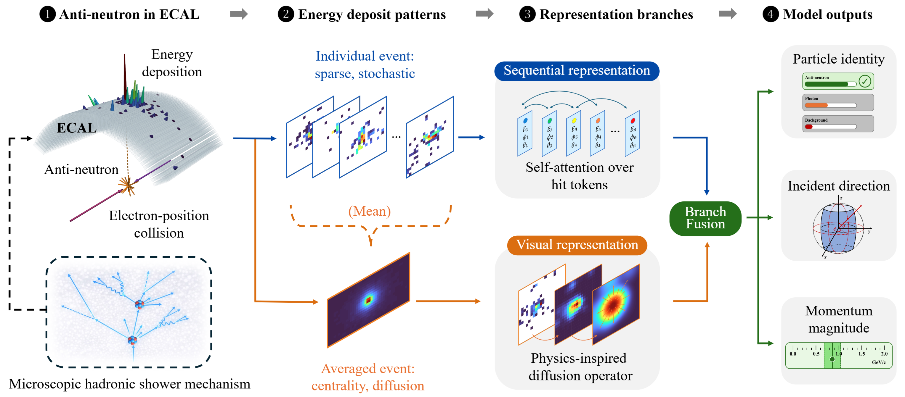

# From ViC, to ANT, and then to MrCAL

## Vision Calorimeter for High-Energy Particle Detection

<div align=center></div>

In the field of high-energy particle physics, estimating anti-neutron parameters (position and momentum) using the electromagnetic calorimeter (EMC) is a fundamental yet challenging problem.
To conquer this challenge, we propose Vision Calorimeter (ViC), an approach that migrates visual object detectors to analyze particle images.
The motivation lies in introducing a physics-inspired heat-conduction operator (HCO) into the detector's backbone and head, to model the discrete and sparse patterns of these images.
Based on physical heat-conduction, HCO is born with local-first prior and global receptive field, which benefit modeling the scattered energy of particle on EMC.
Implemented via the Discrete Cosine Transform, HCO extracts frequency-domain features, which facilitates detecting discrete components of particle patterns.
Experiments demonstrate that ViC significantly outperforms conventional methods, reducing the incident position prediction error by 46.16\% (from 17.31° to 9.32°) and providing the first baseline result with an incident momentum regression error of 21.48\%.
This study underscores ViC's great potential as a reliable particle detector for high-energy physics.

## Anti-Neutron Transformer Pre-trained with Position Cloze Procedure for High-Energy Particle Detection

<div align=center></div>

In high-energy particle physics, anti-neutron detection is an important yet challenging problem, as the energy hit responses of the electromagnetic calorimeter (EMC) are sparse, irregular and non-local.
Conventional data processing algorithms largely depend on local energy distribution, which struggle to capture the structural relation between EMC responses and the position and momentum of anti-neutrons.
In this study, we propose the Anti-Neutron Transformer (ANT), a representation learning approach that uses a single energy hit as the token unit and converts EMC readouts into a hit-token sequence.
The key to building such a representation is the position cloze procedure (PCP), a pre-training strategy where the Transformer model removes and then recovers the positional information of selected high-energy hits.
By recovering hit positions from surrounding energy magnitudes, PCP learns the implicit spatial structure prior of hits, thereby enabling the representation of the sparse, irregular and non-local hit patterns.
This goes beyond the conventional masked autoencoder (MAE) that reconstructs content values given positional information.
To pre-train ANT, we collect more than 11 million particle collision events and validate that ANT equipped with linear detection layers reduces the position prediction error from 17.31° to 9.17°.
Moreover, ANT realizes anti-neutron momentum regression using deep learning for the first time, achieving a relative error of 20.78\%.

## Learning physics-aligned representations for anti-neutron reconstruction in electromagnetic calorimeters

<div align=center></div>

A long-standing limitation in GeV-scale accelerator experiments is the reconstruction of long-lived neutral hadrons in current electromagnetic calorimeters (ECALs), where hadron-nucleus interactions fall outside the detector's native response regime.
In this study, we develop a physics-aligned representation approach for anti-neutron reconstruction using a large corpus of real collision data.
Motivated by two distinct energy deposit patterns in ECALs, we introduce a mixed-representation calorimetric network (MrCAL) that integrates visual and sequential representation branches within a unified object-detection architecture.
This architecture is able to infer particle identity, momentum direction, and momentum magnitude simultaneously.
Our approach improves the precision of anti-neutron momentum-direction reconstruction by up to 96\% and, for the first time, enables direct measurement of momentum magnitude from ECAL information alone, achieving approximately 17\% resolution at 1 GeV/c.
Extensive generalization tests across diverse kinematic and background conditions demonstrate robust performance, supporting experimental viability and broader implications for out-of-domain detector design and operation.

## Dataset

A [valset](https://github.com/yuhongtian17/ViC/releases/download/ViC-checkpoints/Nm_1m__b00000001__e00100000.json) of $\bar{n}$ dataset is available.

## Install MMDetection Step by Step

Yes indeed, it depends on [PyTorch](https://pytorch.org/), [MMCV](https://github.com/open-mmlab/mmcv), [MMEngine](https://github.com/open-mmlab/mmengine) and [MMDetection](https://github.com/open-mmlab/mmdetection):

```shell
# Also: cann-8.0.rc2, torch-2.1.0, torch_npu-2.1.0.post6, mmengine-0.10.5, mmcv-2.2.0, mmdet-3.3.0

wget https://developer.download.nvidia.com/compute/cuda/12.4.1/local_installers/cuda_12.4.1_550.54.15_linux.run
chmod +x ./cuda_12.4.1_550.54.15_linux.run
sudo sh cuda_12.4.1_550.54.15_linux.run

# Add CUDA path
echo "export PATH=/usr/local/cuda-12.4/bin:\$PATH" >> ~/.bashrc
echo "export LD_LIBRARY_PATH=/usr/local/cuda-12.4/lib64:\$LD_LIBRARY_PATH" >> ~/.bashrc
echo "" >> ~/.bashrc
source ~/.bashrc
nvcc -V

# NO sudo when install anaconda
# wget https://mirrors.pku.edu.cn/anaconda/archive/Anaconda3-2025.12-2-Linux-x86_64.sh
wget https://mirror.tuna.tsinghua.edu.cn/anaconda/archive/Anaconda3-2025.12-2-Linux-x86_64.sh
chmod +x ./Anaconda3-2025.12-2-Linux-x86_64.sh
./Anaconda3-2025.12-2-Linux-x86_64.sh

conda create -n openmmlab241b python=3.9 -y
conda activate openmmlab241b
pip -V

# ref: https://pytorch.org/get-started/previous-versions/
conda install pytorch==2.4.1 torchvision==0.19.1 torchaudio==2.4.1 pytorch-cuda=12.4 -c pytorch -c nvidia
python -c "import torch; print(torch.__version__)"

pip install pip==24.3.1 --index https://pypi.tuna.tsinghua.edu.cn/simple/
pip install numpy==1.26.4 ninja==1.11.1.1 psutil==6.1.0 --index https://pypi.tuna.tsinghua.edu.cn/simple/
pip install matplotlib==3.9.3 opencv-python==4.10.0.84 cython==3.0.11 --index https://pypi.tuna.tsinghua.edu.cn/simple/

pip install -U openmim
mim install mmengine==0.10.5
mim install mmcv==2.2.0
# mim install mmdet==3.3.0

# git clone https://github.com/open-mmlab/mmdetection.git
# cd mmdetection
wget https://github.com/open-mmlab/mmdetection/archive/refs/tags/v3.3.0.zip -O mmdetection-3.3.0.zip
unzip mmdetection-3.3.0.zip
cd mmdetection-3.3.0/

# Modify Line 9 in "./mmdet/__init__.py" to >>> mmcv_maximum_version = '3.0.0'
pip install -v -e . --index https://pypi.tuna.tsinghua.edu.cn/simple/

# IF MSCOCO2017 Dataset does not exist
mkdir -p "./data/coco/"
cd "./data/coco/"
wget http://images.cocodataset.org/zips/train2017.zip
wget http://images.cocodataset.org/zips/val2017.zip
wget http://images.cocodataset.org/annotations/annotations_trainval2017.zip
unzip train2017.zip
unzip val2017.zip
unzip annotations_trainval2017.zip
cd ../../

# Try using MMDetection to train RetinaNet with MSCOCO2017
CUDA_VISIBLE_DEVICES=0,1,2,3 ./tools/dist_train.sh ./configs/retinanet/retinanet_r50_fpn_1x_coco.py 4
CUDA_VISIBLE_DEVICES=0,1,2,3 ./tools/dist_train.sh ./configs/swin/retinanet_swin-t-p4-w7_fpn_1x_coco.py 4
```

## Train and Test

```shell
pip install yacs timm uproot openpyxl einops fvcore --index https://pypi.tuna.tsinghua.edu.cn/simple/

# Download our code
cd ../
git clone https://github.com/yuhongtian17/ViC.git
cp -r ViC/mmdetection-main/* mmdetection-3.3.0/
cd mmdetection-3.3.0/

# Prepare dataset
# NOTE: We regret that the release of *.root files requires further data-sharing agreements with BESIII.
cd "./data/"
unzip BESIII_training_sample.zip
cd ../
python ./tools/dataset_converters/root_to_json.py --srcroot "./data/BESIII_training_sample/Nm_1m.root" --df_prefix "Nm_1m" --fn_prefix "Nm_1m"

# ##### ##### ##### ##### ##### ##### ##### ##### ##### ##### #

# Prepare ViC's pre-trained model
mkdir -p "./data/pretrained/"
cd "./data/pretrained/"
wget https://github.com/MzeroMiko/vHeat/releases/download/vheatcls/vHeat_tiny.pth
python ../../tools/model_converters/interpolate4downstream.py --pt_pth 'vHeat_tiny.pth' --tg_pth 'vheat_tiny_512.pth'
cd ../../

# Train ViC
CUDA_VISIBLE_DEVICES=0,1,2,3,4,5,6,7 PORT=33010 ./tools/dist_train.sh "./configs/_hep2coco_/abla/hep-retinanet_vheatk-tiny_fpn_1x_hep2coco-1m_8xbs16.py" 8
# Test ViC
CUDA_VISIBLE_DEVICES=0,1,2,3,4,5,6,7 PORT=33020 ./tools/dist_test.sh "./configs/_hep2coco_/abla/hep-retinanet_vheatk-tiny_fpn_1x_hep2coco-1m_8xbs16.py" "./work_dirs/hep-retinanet_vheatk-tiny_fpn_1x_hep2coco-1m_8xbs16/epoch_12.pth" 8 --out "./work_dirs/results_vic_1m_ep12.pkl"
python ./tools/analysis_tools/hep_eval.py --pkl_path "./work_dirs/results_vic_1m_ep12.pkl" --json_path "./data/HEP2COCO/Nm_1m/Nm_1m__b00000001__e00100000.json"

# ##### ##### ##### ##### ##### ##### ##### ##### ##### ##### #

# Prepare ANT's pre-trained model
cd "./data/pretrained/"
wget https://github.com/yuhongtian17/ViC/releases/download/ANT-checkpoints/selfsup_50x-20250721.pth
mv selfsup_50x-20250721.pth selfsup_50x.pth
cd ../../

# Train and test ANT
model_type="abla"
model_i="hepv2-ssd_trans-base-selfsup_nofpn_trans-head-selfsup_384c-50x_1x_hep2seq-1m_8xbs64"
eval_json="./data/HEP2COCO/Nm_1m/Nm_1m__b00000001__e00100000.json"

./tools/dist_train.sh "./configs/_hep2seq_/${model_type}/${model_i}.py" 8
./tools/dist_test.sh "./configs/_hep2seq_/${model_type}/${model_i}.py" "./work_dirs/${model_i}/epoch_12.pth" 8 --out "./work_dirs/${model_i}/results_ant_1m_ep12.pkl"
python ./tools/analysis_tools/hep_eval.py --pkl_path "./work_dirs/${model_i}/results_ant_1m_ep12.pkl" --json_path "${eval_json}"

# NOTE: Performance with our "ANT_Nm-1m_epoch_12.pth": mAB 9.17° mRE 20.78%
```

## Bugs Report

(1) An error may occur on the new server: "ImportError: libGL.so.1: cannot open shared object file: No such file or directory." It can be solved by the following shell command:

```shell
sudo apt update
sudo apt install libgl1-mesa-glx
```

(2) An error may occur on the RTX 4090 server when training ANT: "RuntimeError: received 0 items of ancdata". It can be solved by the following shell command:

```shell
echo "ulimit -n 1048576" >> ~/.bashrc
source ~/.bashrc
ulimit -n
```

The output result is 1048576 instead of 1024, indicating successful modification.

(3) An error may occur on Ubuntu 24.04 LTS when using python=3.9 for pip or torch. The installation can be updated to:

```shell
conda create -n openmmlab241d python=3.11 -y
conda activate openmmlab241d
pip -V

pip install pip==24.3.1 --index https://pypi.tuna.tsinghua.edu.cn/simple/
pip install torch==2.6.0 torchvision==0.21.0 torchaudio==2.6.0 --index-url https://download.pytorch.org/whl/cu124
python -c "import torch; print(torch.__version__)"
```

In torch 2.6.0, `weights_only=False` needs to be explicitly specified for `torch.load()`.

## License

ViC is released under the [License](LICENSE).

## Appendix A: How to use OpenMMLab series with Ascend 910B

Supported: mmengine-0.10.5, mmcv-latest (>2.2.0, main-241212), mmpretrain-latest (>1.2.0, main-241212), mmdetection-3.3.0, mmyolo-0.6.0, mmrotate-1.x.

```shell
# mirror: cann8.0.RC2-torch2.1.0-conda24.7.1-vscode4.12.0-ubuntu22.04-ssh-arm64
# Execute this command every time a new console is opened!
source /usr/local/Ascend/ascend-toolkit/set_env.sh

conda create -n openmmlab210p6b python=3.9 -y
mkdir -p "/workspace/all-data/envs/"
mv /home/miniconda3/envs/openmmlab210p6b/ /workspace/all-data/envs/
ln -s /workspace/all-data/envs/openmmlab210p6b/ /home/miniconda3/envs/
conda activate openmmlab210p6b
mkdir -p "/workspace/openmmlab210p6b/"
cd "/workspace/openmmlab210p6b/"

# ref: https://www.hiascend.com/document/detail/zh/Pytorch/60RC3/configandinstg/instg/insg_0001.html
# Download PyTorch installation package
wget https://download.pytorch.org/whl/cpu/torch-2.1.0-cp39-cp39-manylinux_2_17_aarch64.manylinux2014_aarch64.whl
# Download torch_npu plugin package
wget https://gitee.com/ascend/pytorch/releases/download/v6.0.rc2-pytorch2.1.0/torch_npu-2.1.0.post6-cp39-cp39-manylinux_2_17_aarch64.manylinux2014_aarch64.whl
# Installation command
pip3 install torch-2.1.0-cp39-cp39-manylinux_2_17_aarch64.manylinux2014_aarch64.whl
pip3 install torch_npu-2.1.0.post6-cp39-cp39-manylinux_2_17_aarch64.manylinux2014_aarch64.whl

# ref: https://pytorch.org/get-started/previous-versions/#v210
pip install torchvision==0.16.0 --index https://pypi.tuna.tsinghua.edu.cn/simple/

# ref: https://gitee.com/ascend/MindSpeed
git clone https://gitee.com/ascend/MindSpeed.git
pip install -e MindSpeed

pip install numpy==1.26.4 ninja==1.11.1.1 psutil==6.1.0 pandas libcst prettytable jedi

pip install mmengine==0.10.5

# ref: https://mmcv.readthedocs.io/zh-cn/v2.0.1/get_started/build.html#npu-mmcv
wget https://github.com/open-mmlab/mmcv/archive/refs/heads/main.zip -O mmcv-2.2.x.zip
unzip mmcv-2.2.x.zip
mv mmcv-main mmcv-2.2.x
cd mmcv-2.2.x/
MMCV_WITH_OPS=1 MAX_JOBS=8 FORCE_NPU=1 python setup.py build_ext
MMCV_WITH_OPS=1 FORCE_NPU=1 python setup.py develop
cd ../

wget https://github.com/open-mmlab/mmpretrain/archive/refs/heads/main.zip -O mmpretrain-1.2.x.zip
unzip mmpretrain-1.2.x.zip
mv mmpretrain-main mmpretrain-1.2.x
cd mmpretrain-1.2.x/
pip install -v -e .
cd ../

wget https://github.com/open-mmlab/mmdetection/archive/refs/tags/v3.3.0.zip -O mmdetection-3.3.0.zip
unzip mmdetection-3.3.0.zip
cd mmdetection-3.3.0/
pip install -r requirements/build.txt
pip install -v -e .

# IMPORTANT: Change to mmcv_maximum_version='3.0.0' in ./mmdet/__init__.py
# TRAIN
# ./tools/dist_train.sh ./configs/swin/retinanet_swin-t-p4-w7_fpn_1x_coco.py 4
# nohup ./tools/dist_train.sh ./configs/swin/retinanet_swin-t-p4-w7_fpn_1x_coco.py 4 > nohup.log 2>&1 &
cd ../

# ##### ##### ##### ##### ##### ##### ##### ##### ##### ##### #

wget https://github.com/open-mmlab/mmyolo/archive/refs/tags/v0.6.0.zip -O mmyolo-0.6.0.zip
unzip mmyolo-0.6.0.zip
cd mmyolo-0.6.0/
# ref: https://github.com/open-mmlab/mmyolo/issues/1018
pip install albumentations==1.4.0
pip install -r requirements/albu.txt
pip install -v -e .

# IMPORTANT: Change to mmcv_maximum_version='3.0.0' in ./mmyolo/__init__.py
# TRAIN
# ./tools/dist_train.sh ./configs/yolov8/yolov8_s_syncbn_fast_8xb16-500e_coco.py 4
# nohup ./tools/dist_train.sh ./configs/yolov8/yolov8_s_syncbn_fast_8xb16-500e_coco.py 4 > nohup.log 2>&1 &
cd ../

# ##### ##### ##### ##### ##### ##### ##### ##### ##### ##### #

pip install ../whl/mx_driving-1.0.0+gitb771879-cp39-cp39-linux_aarch64.whl
export ASCEND_CUSTOM_OPP_PATH=/home/miniconda3/envs/openmmlab210p6b/lib/python3.9/site-packages/mx_driving/packages/vendors/customize/
export LD_LIBRARY_PATH=/home/miniconda3/envs/openmmlab210p6b/lib/python3.9/site-packages/mx_driving/packages/vendors/customize/op_api/lib/:$LD_LIBRARY_PATH

wget https://github.com/open-mmlab/mmrotate/archive/refs/heads/1.x.zip -O mmrotate-1.x.zip
unzip mmrotate-1.x.zip
cd mmrotate-1.x/
pip install -r requirements/build.txt
pip install -v -e .

# IMPORTANT: Change to mmcv_maximum_version='3.0.0', mmdet_maximum_version='4.0.0' in ./mmrotate/__init__.py
# TRAIN
# chmod +x ./tools/*.sh
# ASCEND_RT_VISIBLE_DEVICES=4,5,6,7 ./tools/dist_train.sh ./configs/rotated_retinanet/rotated-retinanet-rbox-le90_r50_fpn_1x_dota.py 4
# nohup ASCEND_RT_VISIBLE_DEVICES=4,5,6,7 ./tools/dist_train.sh ./configs/rotated_retinanet/rotated-retinanet-rbox-le90_r50_fpn_1x_dota.py 4 > nohup.log 2>&1 &
cd ../
```

## Appendix B: How to use jupyter notebook

```shell
# ref: https://zhuanlan.zhihu.com/p/440080687
pip install jupyter notebook
jupyter notebook --generate-config
jupyter notebook password
cat ~/.jupyter/jupyter_server_config.json

vi ~/.jupyter/jupyter_notebook_config.py
# Add jupyter info
# c.NotebookApp.ip = '*'
# c.NotebookApp.password = 'argon2:xxxxxxxx'
# c.NotebookApp.open_browser = False
# c.NotebookApp.port = 8890
# c.NotebookApp.enable_mathjax = True
# c.NotebookApp.allow_remote_access = True
# c.NotebookApp.allow_root = True

jupyter notebook

# ##### ##### ##### ##### ##### ##### ##### ##### ##### ##### #

ssh -L 8888:localhost:8890 {username}@{IPv4/IPv6 address} -p {ssh port}
```
