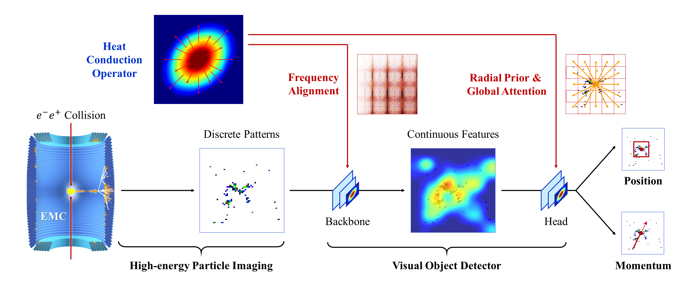

# Vision Calorimeter

<p align="left">
<a href="https://arxiv.org/abs/2408.10599">"></a>
</p>

## Abstract

<div align=center></div>

In high-energy physics, accurately estimating the kinematic parameters (position and momentum) of anti-neutrons ($\bar{n}$) is essential for exploring the fundamental governing principles.
However, this process is particularly challenging when using an electromagnetic calorimeter (EMC) as the energy detector, due to their limited accuracy and efficiency in interacting with $\bar{n}$.
To address this issue, we propose Vision Calorimeter (ViC), a data-driven framework which migrates visual object detection techniques to high-energy particle images.
To accommodate the unique characteristics of particle images, we introduce the heat-conduction operator (HCO) into both the backbone and the head of the conventional object detector and conduct significant structural improvements.
HCO enjoys the advantage of both radial prior and global attention, as it is inspired by physical heat conduction which naturally aligns with the pattern of particle incidence.
Implemented via the Discrete Cosine Transform (DCT), HCO extracts frequency-domain features, bridging the distribution gap between the particle images and the natural images on which visual object detectors are pre-trained.
Experimental results demonstrate that ViC significantly outperforms traditional approaches, reducing the incident position prediction error by 46.16\% (from $17.31^{\circ}$ to $9.32^{\circ}$) and providing the first baseline result with an incident momentum regression error of 21.48\%.
This study underscores ViC's great potential as a general-purpose particle parameter estimator in high-energy physics. Code is available at https://github.com/yuhongtian17/ViC.

Full paper is available at https://arxiv.org/abs/2408.10599.

## Dataset

A [valset](https://github.com/yuhongtian17/ViC/releases/download/ViC-250214/Nm_1m__b00000001__e00100000.json) of $\bar{n}$ dataset is available.

## Install MMDetection Step by Step

Yes indeed, it depends on [PyTorch](https://pytorch.org/), [MMCV](https://github.com/open-mmlab/mmcv), [MMEngine](https://github.com/open-mmlab/mmengine) and [MMDetection](https://github.com/open-mmlab/mmdetection):

```shell
# Also: cuda-12.4.1, torch-2.4.1, mmengine-0.10.4/0.10.5, mmcv-2.1.0/2.2.0, mmdet-3.3.0
# Also: cann-8.0.rc2, torch-2.1.0, torch_npu-2.1.0.post6, mmengine-0.10.5, mmcv-2.2.0, mmdet-3.3.0

wget https://developer.download.nvidia.com/compute/cuda/11.7.1/local_installers/cuda_11.7.1_515.65.01_linux.run
chmod +x ./cuda_11.7.1_515.65.01_linux.run
sudo sh cuda_11.7.1_515.65.01_linux.run

vi ~/.bashrc
# Add CUDA path
# export PATH=/usr/local/cuda-11.7/bin:$PATH
# export LD_LIBRARY_PATH=/usr/local/cuda-11.7/lib64:$LD_LIBRARY_PATH
source ~/.bashrc
nvcc -V

# NO sudo when install anaconda
wget https://mirror.tuna.tsinghua.edu.cn/anaconda/archive/Anaconda3-2024.10-1-Linux-x86_64.sh
chmod +x ./Anaconda3-2024.10-1-Linux-x86_64.sh
./Anaconda3-2024.10-1-Linux-x86_64.sh

conda create -n openmmlab1131 python=3.9 -y
conda activate openmmlab1131
# ref: https://pytorch.org/get-started/previous-versions/#v1131
conda install pytorch==1.13.1 torchvision==0.14.1 torchaudio==0.13.1 pytorch-cuda=11.7 -c pytorch -c nvidia

pip install numpy==1.26.4 ninja==1.11.1.1 psutil==6.1.0

pip install -U openmim
mim install mmengine==0.10.4
mim install mmcv==2.0.1
mim install mmpretrain==1.2.0
# mim install mmdet==3.3.0

# git clone https://github.com/open-mmlab/mmdetection.git
# cd mmdetection
wget https://github.com/open-mmlab/mmdetection/archive/refs/tags/v3.3.0.zip -O mmdetection-3.3.0.zip
unzip mmdetection-3.3.0.zip
cd mmdetection-3.3.0/

pip install -r requirements/build.txt
pip install -v -e .

# IF MSCOCO2017 Dataset does not exist
mkdir -p "./data/coco/"
cd "./data/coco/"
wget http://images.cocodataset.org/zips/train2017.zip
wget http://images.cocodataset.org/zips/val2017.zip
wget http://images.cocodataset.org/annotations/annotations_trainval2017.zip
unzip train2017.zip
unzip val2017.zip
unzip annotations_trainval2017.zip
cd ../../

# Try using MMDetection to train RetinaNet with MSCOCO2017
CUDA_VISIBLE_DEVICES=0,1,2,3 ./tools/dist_train.sh ./configs/retinanet/retinanet_r50_fpn_1x_coco.py 4
CUDA_VISIBLE_DEVICES=0,1,2,3 ./tools/dist_train.sh ./configs/swin/retinanet_swin-t-p4-w7_fpn_1x_coco.py 4
```

## Train and Test with ViC

ViC main code:

```shell
pip install yacs timm uproot openpyxl einops fvcore

# Download our code
cd ../
git clone https://github.com/yuhongtian17/ViC.git
cp -r ViC/mmdetection-main/* mmdetection-3.3.0/
cd mmdetection-3.3.0/

# Prepare pre-trained model
mkdir -p "./data/pretrained/"
cd "./data/pretrained/"
wget https://github.com/MzeroMiko/vHeat/releases/download/vheatcls/vHeat_tiny.pth
python ../../vheat_pth_tools/interpolate4downstream.py --pt_pth 'vHeat_tiny.pth' --tg_pth 'vheat_tiny_512.pth'
cd ../

# Prepare dataset
# NOTE: We regret that the release of *.root files requires further data-sharing agreements with BESIII.
unzip BESIII_training_sample.zip
cd ../
python ./tools/dataset_converters/root_to_json.py --srcfile "./data/BESIII_training_sample/Nm_1m.root" --destroot "./data/HEP2COCO/"

# Train ViC
CUDA_VISIBLE_DEVICES=0,1,2,3 PORT=33010 ./tools/dist_train.sh "./configs/_hep2coco_/hep-retinanet_vheatk-tiny_fpn_1x_hep2coco.py" 4
# Test ViC
CUDA_VISIBLE_DEVICES=0,1,2,3 PORT=33020 ./tools/dist_test.sh "./configs/_hep2coco_/hep-retinanet_vheatk-tiny_fpn_1x_hep2coco.py" "./work_dirs/hep-retinanet_vheatk-tiny_fpn_1x_hep2coco/epoch_12.pth" 4 --out "./work_dirs/hep-retinanet_vheatk-tiny_fpn_1x_hep2coco/results_ep12.pkl"
python ./tools/analysis_tools/hep_eval.py --pkl "./work_dirs/hep-retinanet_vheatk-tiny_fpn_1x_hep2coco/results_ep12.pkl" --json "./data/HEP2COCO/bbox_scale_10/Nm_1m__b00000001__e00100000.json" --output_dir "./work_dirs/hep-retinanet_vheatk-tiny_fpn_1x_hep2coco/" --excel_name "results_ep12.xlsx"
```

## Bugs Report

An error may occur on the new server: "ImportError: libGL.so.1: cannot open shared object file: No such file or directory." It can be solved by the following shell command:

```shell
sudo apt update
sudo apt install libgl1-mesa-glx
```

## Citation

```
@article{vic,
  title={Vision Calorimeter: Migrating Visual Object Detector to High-energy Particle Images},
  author={Yu, Hongtian and Li, Yangu and Liu, Yunfan and Song, Yunxuan and Lyu, Xiaorui and Ye, Qixiang},
  journal={arXiv preprint arXiv:2408.10599},
  year={2024}
}
```

## License

ViC is released under the [License](LICENSE).

## Appendix A: How to use OpenMMLab series with Ascend 910B

Supported: mmengine-0.10.5, mmcv-latest (>2.2.0, main-241212), mmpretrain-latest (>1.2.0, main-241212), mmdetection-3.3.0, mmyolo-0.6.0, mmrotate-1.x.

```shell
# mirror: cann8.0.RC2-torch2.1.0-conda24.7.1-vscode4.12.0-ubuntu22.04-ssh-arm64
# Execute this command every time a new console is opened!
source /usr/local/Ascend/ascend-toolkit/set_env.sh

conda create -n openmmlab210p6b python=3.9 -y
mkdir -p "/workspace/all-data/envs/"
mv /home/miniconda3/envs/openmmlab210p6b/ /workspace/all-data/envs/
ln -s /workspace/all-data/envs/openmmlab210p6b/ /home/miniconda3/envs/
conda activate openmmlab210p6b
mkdir -p "/workspace/openmmlab210p6b/"
cd "/workspace/openmmlab210p6b/"

# ref: https://www.hiascend.com/document/detail/zh/Pytorch/60RC3/configandinstg/instg/insg_0001.html
# Download PyTorch installation package
wget https://download.pytorch.org/whl/cpu/torch-2.1.0-cp39-cp39-manylinux_2_17_aarch64.manylinux2014_aarch64.whl
# Download torch_npu plugin package
wget https://gitee.com/ascend/pytorch/releases/download/v6.0.rc2-pytorch2.1.0/torch_npu-2.1.0.post6-cp39-cp39-manylinux_2_17_aarch64.manylinux2014_aarch64.whl
# Installation command
pip3 install torch-2.1.0-cp39-cp39-manylinux_2_17_aarch64.manylinux2014_aarch64.whl
pip3 install torch_npu-2.1.0.post6-cp39-cp39-manylinux_2_17_aarch64.manylinux2014_aarch64.whl

# ref: https://pytorch.org/get-started/previous-versions/#v210
pip install torchvision==0.16.0 --index https://pypi.tuna.tsinghua.edu.cn/simple/

# ref: https://gitee.com/ascend/MindSpeed
git clone https://gitee.com/ascend/MindSpeed.git
pip install -e MindSpeed

pip install numpy==1.26.4 ninja==1.11.1.1 psutil==6.1.0 pandas libcst prettytable jedi

pip install mmengine==0.10.5

# ref: https://mmcv.readthedocs.io/zh-cn/v2.0.1/get_started/build.html#npu-mmcv
wget https://github.com/open-mmlab/mmcv/archive/refs/heads/main.zip -O mmcv-2.2.x.zip
unzip mmcv-2.2.x.zip
mv mmcv-main mmcv-2.2.x
cd mmcv-2.2.x/
MMCV_WITH_OPS=1 MAX_JOBS=8 FORCE_NPU=1 python setup.py build_ext
MMCV_WITH_OPS=1 FORCE_NPU=1 python setup.py develop
cd ../

wget https://github.com/open-mmlab/mmpretrain/archive/refs/heads/main.zip -O mmpretrain-1.2.x.zip
unzip mmpretrain-1.2.x.zip
mv mmpretrain-main mmpretrain-1.2.x
cd mmpretrain-1.2.x/
pip install -v -e .
cd ../

wget https://github.com/open-mmlab/mmdetection/archive/refs/tags/v3.3.0.zip -O mmdetection-3.3.0.zip
unzip mmdetection-3.3.0.zip
cd mmdetection-3.3.0/
pip install -r requirements/build.txt
pip install -v -e .

# IMPORTANT: Change to mmcv_maximum_version='3.0.0' in ./mmdet/__init__.py
# TRAIN
# ./tools/dist_train.sh ./configs/swin/retinanet_swin-t-p4-w7_fpn_1x_coco.py 4
# nohup ./tools/dist_train.sh ./configs/swin/retinanet_swin-t-p4-w7_fpn_1x_coco.py 4 > nohup.log 2>&1 &
cd ../

# ##### ##### ##### ##### ##### ##### ##### ##### ##### ##### #

wget https://github.com/open-mmlab/mmyolo/archive/refs/tags/v0.6.0.zip -O mmyolo-0.6.0.zip
unzip mmyolo-0.6.0.zip
cd mmyolo-0.6.0/
# ref: https://github.com/open-mmlab/mmyolo/issues/1018
pip install albumentations==1.4.0
pip install -r requirements/albu.txt
pip install -v -e .

# IMPORTANT: Change to mmcv_maximum_version='3.0.0' in ./mmyolo/__init__.py
# TRAIN
# ./tools/dist_train.sh ./configs/yolov8/yolov8_s_syncbn_fast_8xb16-500e_coco.py 4
# nohup ./tools/dist_train.sh ./configs/yolov8/yolov8_s_syncbn_fast_8xb16-500e_coco.py 4 > nohup.log 2>&1 &
cd ../

# ##### ##### ##### ##### ##### ##### ##### ##### ##### ##### #

pip install ../whl/mx_driving-1.0.0+gitb771879-cp39-cp39-linux_aarch64.whl
export ASCEND_CUSTOM_OPP_PATH=/home/miniconda3/envs/openmmlab210p6b/lib/python3.9/site-packages/mx_driving/packages/vendors/customize/
export LD_LIBRARY_PATH=/home/miniconda3/envs/openmmlab210p6b/lib/python3.9/site-packages/mx_driving/packages/vendors/customize/op_api/lib/:$LD_LIBRARY_PATH

wget https://github.com/open-mmlab/mmrotate/archive/refs/heads/1.x.zip -O mmrotate-1.x.zip
unzip mmrotate-1.x.zip
cd mmrotate-1.x/
pip install -r requirements/build.txt
pip install -v -e .

# IMPORTANT: Change to mmcv_maximum_version='3.0.0', mmdet_maximum_version='4.0.0' in ./mmrotate/__init__.py
# TRAIN
# chmod +x ./tools/*.sh
# ASCEND_RT_VISIBLE_DEVICES=4,5,6,7 ./tools/dist_train.sh ./configs/rotated_retinanet/rotated-retinanet-rbox-le90_r50_fpn_1x_dota.py 4
# nohup ASCEND_RT_VISIBLE_DEVICES=4,5,6,7 ./tools/dist_train.sh ./configs/rotated_retinanet/rotated-retinanet-rbox-le90_r50_fpn_1x_dota.py 4 > nohup.log 2>&1 &
cd ../
```

## Appendix B: How to use jupyter notebook

```shell
# ref: https://zhuanlan.zhihu.com/p/440080687
pip install jupyter notebook
jupyter notebook --generate-config
jupyter notebook password
cat ~/.jupyter/jupyter_server_config.json

vi ~/.jupyter/jupyter_notebook_config.py
# Add jupyter info
# c.NotebookApp.ip = '*'
# c.NotebookApp.password = 'argon2:xxxxxxxx'
# c.NotebookApp.open_browser = False
# c.NotebookApp.port = 8890
# c.NotebookApp.enable_mathjax = True
# c.NotebookApp.allow_remote_access = True
# c.NotebookApp.allow_root = True

jupyter notebook

# ##### ##### ##### ##### ##### ##### ##### ##### ##### ##### #

ssh -L 8888:localhost:8890 {username}@{IPv4/IPv6 address} -p {ssh port}
```
