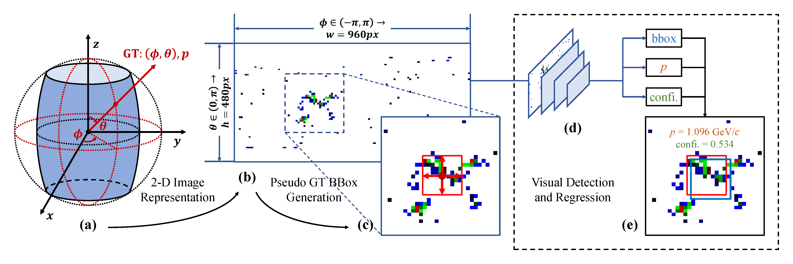

# Vision Calorimeter

<p align="left">
<a href="https://arxiv.org/abs/2408.10599">"></a>
</p>

## Abstract

<div align=center></div>

In high-energy physics, anti-neutrons ($\bar{n}$) are fundamental particles that frequently appear as final-state particles, and the reconstruction of their kinematic properties provides an important probe for understanding the governing principles. However, this confronts significant challenges instrumentally with the electromagnetic calorimeter (EMC), a typical experimental sensor but recovering the information of incident $\bar{n}$ insufficiently. In this study, we introduce Vision Calorimeter (ViC), a baseline method for anti-neutron reconstruction that leverages deep learning detectors to analyze the implicit relationships between EMC responses and incident $\bar{n}$ characteristics. Our motivation lies in that energy distributions of $\bar{n}$ samples deposited in the EMC cell arrays embody rich contextual information. Converted to 2-D images, such contextual energy distributions can be used to predict the status of $\bar{n}$ ($i.e.$, incident position and momentum) through a deep learning detector along with pseudo bounding boxes and a specified training objective. Experimental results demonstrate that ViC substantially outperforms the conventional reconstruction approach, reducing the prediction error of incident position by 42.81\% (from $17.31^{\circ}$ to $9.90^{\circ}$). More importantly, this study for the first time realizes the measurement of incident $\bar{n}$ momentum, underscoring the potential of deep learning detectors for particle reconstruction. Code is available at https://github.com/yuhongtian17/ViC.

Full paper is available at https://arxiv.org/abs/2408.10599.

## Dataset

A [valset](https://github.com/yuhongtian17/ViC/releases/download/ViC-241203/Nm_1m__b00000001__e00100000.json) of $\bar{n}$ dataset is available.

## Install MMDetection Step by Step

Yes indeed, it depends on [PyTorch](https://pytorch.org/), [MMCV](https://github.com/open-mmlab/mmcv), [MMEngine](https://github.com/open-mmlab/mmengine) and [MMDetection](https://github.com/open-mmlab/mmdetection):

```shell
# Also: cuda-12.4.1, torch-2.4.1, mmengine-0.10.4, mmcv-2.1.0, mmdet-3.3.0
# Also: cann-8.0.rc2, torch-2.1.0, torch_npu-2.1.0.post6, mmengine-0.10.4, mmcv-2.2.0, mmdet-3.3.0

wget https://developer.download.nvidia.com/compute/cuda/11.7.1/local_installers/cuda_11.7.1_515.65.01_linux.run
chmod +x ./cuda_11.7.1_515.65.01_linux.run
sudo sh cuda_11.7.1_515.65.01_linux.run

vi ~/.bashrc
# Add CUDA path
# export PATH=/usr/local/cuda-11.7/bin:$PATH
# export LD_LIBRARY_PATH=/usr/local/cuda-11.7/lib64:$LD_LIBRARY_PATH
source ~/.bashrc
nvcc -V

# NO sudo when install anaconda
wget https://mirror.tuna.tsinghua.edu.cn/anaconda/archive/Anaconda3-2024.10-1-Linux-x86_64.sh
chmod +x ./Anaconda3-2024.10-1-Linux-x86_64.sh
./Anaconda3-2024.10-1-Linux-x86_64.sh

conda create -n openmmlab1131 python=3.9 -y
conda activate openmmlab1131
# ref: https://pytorch.org/get-started/previous-versions/#v1131
conda install pytorch==1.13.1 torchvision==0.14.1 torchaudio==0.13.1 pytorch-cuda=11.7 -c pytorch -c nvidia

pip install numpy==1.26.4 ninja==1.11.1.1 psutil==6.1.0
pip install shapely timm uproot openpyxl

pip install -U openmim
mim install mmengine==0.10.4
mim install mmcv==2.0.1
# mim install mmdet==3.1.0

# git clone https://github.com/open-mmlab/mmdetection.git
# cd mmdetection
# git checkout f78af7785ada87f1ced75a2313746e4ba3149760
wget https://github.com/open-mmlab/mmdetection/archive/refs/tags/v3.1.0.zip -O mmdetection-3.1.0.zip
unzip mmdetection-3.1.0.zip
cd mmdetection-3.1.0/

pip install -r requirements/build.txt
pip install -v -e .

# IF MSCOCO2017 Dataset does not exist
mkdir -p "./data/coco/"
cd "./data/coco/"
wget http://images.cocodataset.org/zips/train2017.zip
wget http://images.cocodataset.org/zips/val2017.zip
wget http://images.cocodataset.org/annotations/annotations_trainval2017.zip
unzip train2017.zip
unzip val2017.zip
unzip annotations_trainval2017.zip
cd ../../

# Try using MMDetection to train RetinaNet with MSCOCO2017
CUDA_VISIBLE_DEVICES=0,1,2,3 ./tools/dist_train.sh ./configs/retinanet/retinanet_r50_fpn_1x_coco.py 4
CUDA_VISIBLE_DEVICES=0,1,2,3 ./tools/dist_train.sh ./configs/swin/retinanet_swin-t-p4-w7_fpn_1x_coco.py 4
```

## Train and Test with ViC

ViC main code:

```shell
# Download our code
cd ../
git clone https://github.com/yuhongtian17/ViC.git
cp -r ViC/mmdetection-3.1.0/* mmdetection-3.1.0/
cd mmdetection-3.1.0/

# Prepare pre-trained model
mkdir -p "./data/pretrained/"
cd "./data/pretrained/"
wget https://github.com/SwinTransformer/storage/releases/download/v1.0.0/swin_tiny_patch4_window7_224.pth
cd ../

# Prepare dataset
# NOTE: We regret that the release of *.root files requires further data-sharing agreements with BESIII.
unzip BESIII_training_sample.zip
cd ../
python ./tools/dataset_converters/root_to_json.py --srcfile "./data/BESIII_training_sample/Nm_1m.root" --destroot "./data/HEP2COCO/"

# Train ViC
CUDA_VISIBLE_DEVICES=0,1,2,3 PORT=33010 ./tools/dist_train.sh ./configs/_hep2coco_/retinanet_swin-tiny_fpn_1x_hep2coco.py 4
# Test ViC
CUDA_VISIBLE_DEVICES=0,1,2,3 PORT=33020 ./tools/dist_test.sh "./configs/_hep2coco_/retinanet_swin-tiny_fpn_1x_hep2coco.py" "./work_dirs/retinanet_swin-tiny_fpn_1x_hep2coco/epoch_12.pth" 4 --out "./work_dirs/retinanet_swin-tiny_fpn_1x_hep2coco/results_ep12.pkl"
python ./tools/analysis_tools/hep_eval.py --pkl "./work_dirs/retinanet_swin-tiny_fpn_1x_hep2coco/results_ep12.pkl" --json "./data/HEP2COCO/bbox_scale_10/Nm_1m__b00000001__e00100000.json" --output_dir "./work_dirs/retinanet_swin-tiny_fpn_1x_hep2coco/" --excel_name "results_ep12.xlsx"

# Visualize Predictions
python ./tools/analysis_tools/hep_eval.py --pkl "./work_dirs/retinanet_swin-tiny_fpn_1x_hep2coco/results_ep12.pkl" --json "./data/HEP2COCO/bbox_scale_10/Nm_1m__b00000001__e00100000.json" --output_dir "./work_dirs/retinanet_swin-tiny_fpn_1x_hep2coco/visual/" --visual_ind 0 --visual_end 100

# nohup a shell file
nohup bash ./hep.sh > nohup.log 2>&1 &
```

Ablation study with "optional-1":

```shell
cd ../
cp -r ViC/optional-1/* mmdetection-3.1.0/
cd mmdetection-3.1.0/
```

Try VMamba and vHeat with "optional-2":

```shell
cd ../
cp -r ViC/optional-2/* mmdetection-3.1.0/
cd mmdetection-3.1.0/

# VMamba
pip install einops fvcore triton
cd kernels/selective_scan/ && pip install . && cd ../../

# Prepare pre-trained model
mkdir -p "./data/pretrained/"
cd "./data/pretrained/"
wget https://github.com/MzeroMiko/VMamba/releases/download/%23v2cls/vssm1_tiny_0230s_ckpt_epoch_264.pth
wget https://github.com/MzeroMiko/vHeat/releases/download/vheatcls/vHeat_tiny.pth
cd ../../
python ./vheat_tools/interpolate4downstream.py --pt_pth './data/pretrained/vHeat_tiny.pth' --tg_pth './data/pretrained/vheat_tiny_512.pth'
```

## Bugs Report

An error may occur on the new server: "ImportError: libGL.so.1: cannot open shared object file: No such file or directory." It can be solved by the following shell command:

```shell
sudo apt update
sudo apt install libgl1-mesa-glx
```

## Citation

```
@article{vic,
  title={Vision Calorimeter for Anti-neutron Reconstruction: A Baseline},
  author={Yu, Hongtian and Li, Yangu and Wu, Mingrui and Shen, Letian and Liu, Yue and Song, Yunxuan and Ye, Qixiang and Lyu, Xiaorui and Mao, Yajun and Zheng, Yangheng and Liu, Yunfan},
  journal={arXiv preprint arXiv:2408.10599},
  year={2024}
}
```

## License

ViC is released under the [License](LICENSE).

